# AnnData Storage Audit — actionet-python

All slot writes flow through `persist_updates()` in [`_backed_persist.py`](src/actionet/_backed_persist.py), which handles both in-memory and backed HDF5 writes atomically.

---

## Pipeline write order (`run_actionet`)

```mermaid
flowchart TD
    reduceKernel["reduce_kernel()"] --> obsm_action["obsm[action]  n×k"]
    reduceKernel --> obsm_B["obsm[action_B]  n×k"]
    reduceKernel --> varm_U["varm[action_U]  g×k"]
    reduceKernel --> varm_A["varm[action_A]  g×k"]
    reduceKernel --> uns_params["uns[action_params]  dict"]

    runAction["run_action()"] --> obsm_Hstacked["obsm[H_stacked]  n×K_total"]
    runAction --> obsm_Hmerged["obsm[H_merged]  n×K_merged"]
    runAction --> obsm_Cstacked["obsm[C_stacked]  n×K_total"]
    runAction --> obsm_Cmerged["obsm[C_merged]  n×K_merged"]

    buildNetwork["build_network()"] --> obsp_net["obsp[actionet]  n×n sparse"]

    diffusion["compute_network_diffusion()"] --> obsm_footprint["obsm[archetype_footprint]  n×K_merged"]

    layout2d["layout_network() 2D"] --> obsm_2d["obsm[umap_2d_actionet]  n×2"]
    layout3d["layout_network() 3D"] --> obsm_3d["obsm[umap_3d_actionet]  n×3"]

    colors["compute_node_colors()"] --> obsm_colors["obsm[colors_actionet]  n×3"]

    specificity["compute_archetype_feature_specificity()"] --> varm_profile["varm[archetype_feat_profile]  g×K_merged"]
    specificity --> varm_upper["varm[archetype_feat_specificity_upper]  g×K_merged"]
    specificity --> varm_lower["varm[archetype_feat_specificity_lower]  g×K_merged"]
```

---

## Full catalog with usage classification

### obsm — cell-level (rows = n_cells)

| Key | Shape | Written by | Used downstream | Classification |
|---|---|---|---|---|
| `action` | n×k | `reduce_kernel` | `run_action`, `correct_batch_effect`, `smooth_kernel` | **Essential** |
| `action_B` | n×k | `reduce_kernel` | `_load_reduction_state` (batch correction), `smooth_kernel` | **Essential** (SVD factorization) |
| `H_stacked` | n×K_total | `run_action` | `build_network` (default input) | **Essential** (sole input to network) |
| `H_merged` | n×K_merged | `run_action` | `compute_network_diffusion`, `impute_from_archetypes` | **Essential** |
| `C_stacked` | n×K_total | `run_action` | **Nowhere in pipeline** | **Never used** — large, same size as H_stacked |
| `C_merged` | n×K_merged | `run_action` | **Nowhere in pipeline** | **Never used** — same size as H_merged |
| `archetype_footprint` | n×K_merged | `compute_network_diffusion` | `layout_network` (2D+3D warm start), `compute_archetype_feature_specificity` | **Essential** |
| `umap_2d_actionet` | n×2 | `layout_network` | `layout_network` 3D (warm start), plotting | **Essential** |
| `umap_3d_actionet` | n×3 | `layout_network` | `compute_node_colors`, plotting | **Essential** |
| `colors_actionet` | n×3 | `compute_node_colors` | plotting only | **Seldom used** (trivially recomputable, plotting only) |
| `action_corrected` | n×k | `correct_batch_effect` | user-driven downstream, not run_actionet | Optional (only if batch correction run) |
| `action_corrected_B` | n×k | `correct_batch_effect` | `_load_reduction_state` if chained | Optional (only if batch correction run) |
| `action_smoothed` | n×k | `smooth_kernel` | not read back automatically | **Seldom used** (transient imputation intermediate) |

### varm — feature-level (rows = n_genes)

| Key | Shape | Written by | Used downstream | Classification |
|---|---|---|---|---|
| `action_U` | g×k | `reduce_kernel` | `_load_reduction_state` (batch correction), `smooth_kernel` | **Essential** (SVD factorization) |
| `action_A` | g×k | `reduce_kernel` | `_load_reduction_state`, `smooth_kernel` | **Essential** (SVD factorization) |
| `archetype_feat_profile` | g×K_merged | `compute_archetype_feature_specificity` | `impute_from_archetypes` (explicit key arg) | **Seldom used** (imputation only, non-default key) |
| `archetype_feat_specificity_upper` | g×K_merged | `compute_archetype_feature_specificity` | `annotate_clusters` via `specificity_key` arg | **Seldom used** (annotation only, opt-in) |
| `archetype_feat_specificity_lower` | g×K_merged | `compute_archetype_feature_specificity` | `annotate_clusters` via `specificity_key` arg | **Seldom used** (annotation only, opt-in) |
| `action_corrected_U` | g×k | `correct_batch_effect` | chained correction only | Optional |
| `action_corrected_A` | g×k | `correct_batch_effect` | chained correction only | Optional |

### obsp — cell×cell sparse

| Key | Shape | Written by | Used downstream | Classification |
|---|---|---|---|---|
| `actionet` | n×n sparse | `build_network` | diffusion, layout, imputation, clustering, annotation | **Essential** |

### uns — metadata dicts

| Key | Shape | Written by | Used downstream | Classification |
|---|---|---|---|---|
| `action_params` | dict (sigma + metadata) | `reduce_kernel` | `_load_reduction_state`, `smooth_kernel` | **Essential** (sigma vector needed for perturbed SVD) |
| `action_corrected_params` | dict | `correct_batch_effect` | chained correction | Optional |
| `lazy_transform` key | dict | `create_lazy_transform` | not read automatically | **Seldom used** (user-reconstructed only) |

### layers / X

| Key | Shape | Written by | Used downstream | Classification |
|---|---|---|---|---|
| `layers["logcounts"]` (or user key) | n×g | `normalize_anndata` | all downstream functions via `layer=` arg | **Essential** (if using layers pattern) |
| `X` overwrite | n×g | `normalize_anndata` | all downstream | **Essential** (if not using layers) |

---

## Largest "never used" / "seldom used" items — priority targets

1. **`obsm["C_stacked"]`** — `n × K_total` dense float64. `K_total = sum(k_min..k_max)`, so for default `k_min=2, k_max=30` this is `n × 464`. Never read by any pipeline function. Only appears in the legacy `add_action_results` path and is a pass-through from the C++ result. ~**same byte cost as `H_stacked`**.

2. **`obsm["C_merged"]`** — `n × K_merged` dense float64. Never read by any pipeline function. Same byte cost as `H_merged`.

3. **`varm["archetype_feat_specificity_upper"]` + `varm["archetype_feat_specificity_lower"]`** — both `g × K_merged` dense float64. Specificity matrices are only used if the user explicitly calls `annotate_clusters(specificity_key=...)`. For a 20 000-gene dataset with 30 archetypes that's ~4.8 MB each / ~9.6 MB total, per write. **These are the entire point of the `compute_archetype_feature_specificity` step in `run_actionet`** but `annotate_clusters` is rarely called with a pre-computed key.

4. **`varm["archetype_feat_profile"]`** — `g × K_merged` dense float64. Only consumed by `impute_from_archetypes()` and only with a non-default key (`"archetype_feat_profile"` vs. default `"specificity_profile"`), meaning in practice it is rarely read automatically.

5. **`obsm["colors_actionet"]`** — `n × 3` float32. Trivially recomputable from `umap_3d_actionet` in milliseconds. No analysis function depends on it.

6. **`varm["action_U"]`, `varm["action_A"]`, `obsm["action_B"]`** — each `n×k` or `g×k` dense float64. These are only needed if batch correction or `smooth_kernel` will be called. For a dataset where neither is run, all three are dead weight. Combined they total `2*(g*k) + (n*k)` float64 values — for 20 000 genes, 50 000 cells, k=30 that is ~(2×4.8 + 12) MB = ~22 MB of rarely-touched SVD factors.

---

## Relevant TODO note

[`TODO.md`](TODO.md) line 17 already anticipates this:
> Optionally omit C_* and specificity matrices to reduce object size

The `TODO.md` also notes (line 22):
> Remove archetype specificity from run_actionet?

This confirms the specificity triple (`_feat_profile`, `_feat_specificity_upper`, `_feat_specificity_lower`) is a candidate to move out of the default pipeline run entirely.
