# Optimize `impute_features`: Backed Extraction Speed + Diffusion Memory

## Architecture context

`impute_features` has two hot paths that feed into each other:

```mermaid
flowchart LR
    subgraph extraction [Feature Extraction]
        A[backed_take_columns] -->|"CSR: full-matrix scan"| B["X0 dense (cells x features)"]
    end
    subgraph diffusion [Network Diffusion]
        B --> C[scipy_to_arma_sparse]
        C -->|"copy 1"| D[arma::sp_mat G]
        D -->|"copy 2: normalizeGraph by-value"| E[arma::sp_mat P]
        E -->|"copy 3: alpha * P"| F[arma::sp_mat alphaP]
        F --> G[power iteration]
        G --> H[arma_mat_to_numpy_c]
        H -->|"transpose copy"| I["result array"]
    end
```

---

## Bottleneck 1: Backed feature extraction is slow

**Root cause:** For CSR-stored h5ad (the common case), [`take_columns_dense_csr_`](src/libactionet/src/io/backed_h5ad/backed_sparse_matrix_operator.cpp) scans every row and every NNZ of the entire matrix, even when extracting a handful of columns. The inner loop is single-threaded.

### Fix 1a -- Parallelize `take_columns_dense_csr_` with OpenMP

- File: [backed_sparse_matrix_operator.cpp](src/libactionet/src/io/backed_h5ad/backed_sparse_matrix_operator.cpp), function `take_columns_dense_csr_` (line ~698)
- Each row writes to its own output row, so per-row parallelism is race-free
- Add `#pragma omp parallel for` over the `r = row_start..row_end` loop inside each chunk iteration
- Use existing `n_threads_` member and `actionet::get_num_threads()` (same pattern as `rmatmat_csr_`)

### Fix 1b -- Use full chunk size for takeColumns (skip NNZ cap)

- File: [backed_sparse_matrix_operator.cpp](src/libactionet/src/io/backed_h5ad/backed_sparse_matrix_operator.cpp)
- `next_block_end_` throttles I/O via `target_chunk_nnz_`, which is tuned for repeated matvec passes. For a single-pass column extraction, larger reads reduce HDF5 call overhead.
- Add a `takeColumns`-specific block-end helper (or a flag) that uses `chunk_size_` directly without the NNZ cap.

### Gap: CSR column extraction is fundamentally O(total NNZ)

Fixes 1a and 1b improve the CSR `takeColumns` path but don't change its algorithmic complexity: it still scans every row of the matrix even when extracting a handful of columns. CSC `takeColumns` is O(NNZ of selected columns only) — orders of magnitude faster for small column subsets. For CSR-stored h5ad files (the common case), a true fix would require one of:
- Preferring an existing CSC dataset/layer if present in the h5ad
- Building a column→row inverted index at operator construction time (one upfront full scan, then O(selected NNZ) random reads for each extraction)
- Writing a CSC companion dataset to the h5ad on first access

This is left as a future optimization.

---

## Bottleneck 2: `compute_network_diffusion` uses excessive memory

**Root cause:** The graph `G` (cells x cells sparse) is copied 3-4 times between Python and the power iteration inner loop. For 1M cells (~50M edges), each copy is ~800 MB.

### Fix 2a -- `normalizeGraph` in-place (eliminates 2 graph copies)

- File: [matrix_transform.cpp](src/libactionet/src/tools/matrix_transform.cpp), line 125
- Current signature: `arma::sp_mat normalizeGraph(arma::sp_mat G, int norm_method)` -- takes by **value**, returns by value
- Change to: `void normalizeGraph(arma::sp_mat& G, int norm_method)` -- mutate in-place
- File: [matrix_transform.hpp](src/libactionet/include/tools/matrix_transform.hpp) -- update declaration
- Update all call sites:
  - [network_diffusion.cpp](src/libactionet/src/network/network_diffusion.cpp) lines 15, 46, 77 -- `diffusionPowerIter`, `diffusionPowerIterSparse`, `diffusionChebyshev`
  - [label_propagation.cpp](src/libactionet/src/network/label_propagation.cpp) -- uses `normalizeGraph`
- In `diffusionPowerIter`: normalize `G` in-place, then `G *= alpha` in-place, eliminating the temporary `P`

### Fix 2b -- Return Fortran-order from diffusion (eliminates 1 copy)

- File: [wp_network.cpp](src/actionet/wp_network.cpp), line 97
- Change `arma_mat_to_numpy_c(X)` to `arma_mat_to_numpy(X)` -- single `memcpy` instead of element-wise transpose
- The diffusion result is small (cells x features), so the transpose itself isn't huge, but it's a free win
- Verify downstream Python code doesn't assume C-contiguous layout (it passes to `np.maximum` and `pd.DataFrame`, both layout-agnostic)

### Fix 2c -- Fuse `X0_scaled` into the iteration (eliminates 1 dense matrix)

- File: [network_diffusion.cpp](src/libactionet/src/network/network_diffusion.cpp), `diffusionPowerIter` lines 23-24
- Currently allocates `X0_scaled = X0_norm * n` as a separate (cells x features) matrix
- Replace with inline scaling: `X_out.col(i) = y + X0_norm.col(i) * (n_double * arma::as_scalar(zt * X_out.col(i)))` where `n_double = static_cast<double>(n)`
- Apply same optimization to `diffusionPowerIterSparse`

### Fix 2d -- Apply same in-place pattern to Chebyshev path

- File: [network_diffusion.cpp](src/libactionet/src/network/network_diffusion.cpp), `diffusionChebyshev` line 76-77
- `normalizeGraph` is also called by value here -- switch to in-place
- Review `prev_prev`/`prev` temporaries for potential `std::move` optimization (line 97 already does this for `prev`)

---

## Non-code change: Decouple diffusion from AnnData (design only)

- File: [core.py](src/actionet/core.py), `compute_network_diffusion` (line 490) and [imputation.py](src/actionet/imputation.py) line 148
- Both extract `G = adata.obsp[network_key]` independently; if called in sequence the graph is extracted twice
- This is a Python-API design change (your TODO item) -- document the intended new signature but defer implementation to a separate PR

---

## Testing strategy

- Memory: compare peak RSS before/after fix 2a on a ~100K cell dataset using `/usr/bin/time -v` or `tracemalloc`
- Correctness: existing `tests/test_impute.ipynb` and `tests/backed/test_backed_take_columns.py` cover both paths
- Performance: time `backed_take_columns` before/after fix 1a on a backed h5ad
