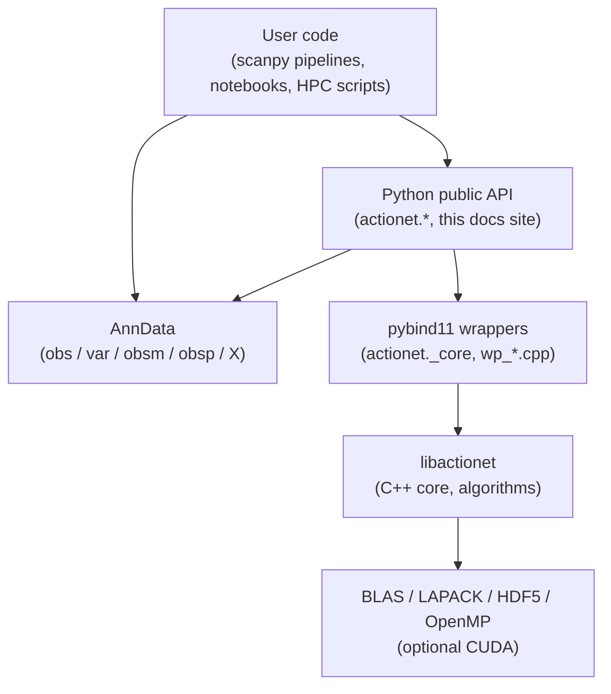

# Architecture

`actionet-python` is a thin, high-performance Python front-end over the
`libactionet` C++ core. Most user-facing functions dispatch through pybind11
into C++ after minimal AnnData plumbing.

## Layering

## What lives where

| Layer | Repository | Documented in |
| --- | --- | --- |
| Python public API | `KellisLab/actionet-python` | **This site** |
| AnnData integration helpers | `KellisLab/actionet-python` | **This site** |
| pybind11 wrappers (`wp_*.cpp`, `_core.cpp`) | `KellisLab/actionet-python` | Not documented (implementation detail) |
| C++ core library | [`KellisLab/libactionet`](https://github.com/KellisLab/libactionet) | Separate docs site (planned) |
| R front-end | [`KellisLab/actionet-r`](https://github.com/KellisLab/actionet-r) | Separate docs |

The C++ core is a shared dependency of both the Python and R front-ends and is
treated as a stable **contract** — see the project's
[agent playbook](https://github.com/KellisLab/actionet-python/blob/dev/context/AGENT_PLAYBOOK.md)
for details. When you want to understand a specific algorithm's C++
implementation, follow the link above to the `libactionet` repository.

## Data flow for a typical call

Most functions in this package follow the same shape:

1. Accept an `AnnData` object plus keyword arguments.
2. Validate and extract the required matrices from `adata.X`, `adata.obsm`,
   `adata.layers`, or `adata.obsp`.
3. Call into the pybind11 layer (`actionet._core`), which passes NumPy /
   SciPy sparse matrices by reference to C++.
4. Receive results back as NumPy arrays.
5. Either mutate the `AnnData` in place (default) or return a new `AnnData`
   (when `inplace=False`).

Because the C++ layer runs with OpenMP parallelism and releases the GIL, these
calls parallelize well and interoperate cleanly with the rest of the scanpy
ecosystem.

## Backed / out-of-core mode

For datasets that don't fit in RAM, several routines support **backed** mode
via HDF5 streaming. See [I/O and backed persistence](api/io.md) for the Python
surface (`LazyTransform`, `checkpoint_backed`, `materialize_backed`,
`subset_backed_inplace`, and auto-persist controls), and the `libactionet` docs
for the underlying streaming operators.

## GPU

GPU support is planned but not yet implemented. See
[`context/GPU_INTEGRATION.md`](https://github.com/KellisLab/actionet-python/blob/dev/context/GPU_INTEGRATION.md)
for the Python-side roadmap and
[`libactionet/context/GPU_BACKEND_PLAN.md`](https://github.com/KellisLab/libactionet/blob/dev/context/GPU_BACKEND_PLAN.md)
for the C++/build-side plan and the post-mortem of the scrapped first attempt.
