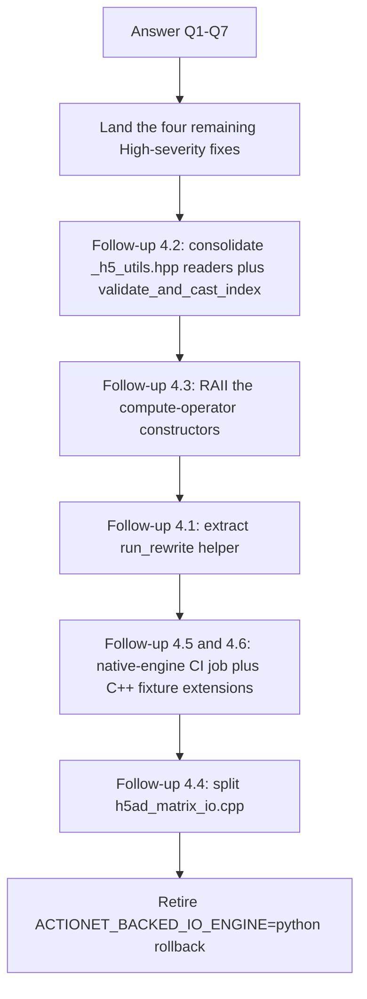

# Native HDF5 Backed-I/O Cleanup Follow-Ups

Date: 2026-07-26
Status: outstanding work after post-audit quick-win pass; ready for scheduled follow-up or delegation
Baseline: parent `8c080c4` + submodule `714d5ed`, plus the local quick-win commit that
landed the Section 1 items below

This document snapshots everything the codebase-cleanup audit surfaced that has
NOT yet been addressed. It is organized so that each item can be picked up
independently or delegated in bulk. Every quick-win listed in the original
audit synthesis is already committed and validated on AnnData 0.13.2 (596
passed, 1 skipped) and is therefore intentionally excluded here.

Companion documents:

- `plans/NATIVE_HDF5_BACKED_IO_IMPLEMENTATION_HANDOFF.md` — architecture and
  non-negotiable safety boundaries.
- `plans/NATIVE_HDF5_BACKED_IO_ROLLOUT.md` — atlas evidence and remaining
  rollout gates.
- `plans/NATIVE_HDF5_BACKED_COLUMN_READ_INVESTIGATION.md` — column-read
  optimization scope and P0/P1/P2 bottleneck list.

## 1. Quick wins already landed (for the record)

These are done and validated. They are listed here only so a future reader can
distinguish "not yet done" from "already handled" without re-auditing the diff.

- `_write_axis_container` identity fast path now consults
  `adapter.matrix_location` before taking the `h5copy` shortcut
  (`src/actionet/io/subset.py`).
- `raw.varm` handling now serializes in-memory replacements per key and only
  falls back to `h5copy` when the in-memory value is still the live backed
  handle (`src/actionet/io/subset.py`).
- `apply_filter(inplace=False, output_file=<source>)` is rejected; in-place
  same-path rewrites go through `_ensure_backed_writable` up front
  (`src/actionet/preprocessing/filter.py`).
- `RewriteTransaction` preserves source file mode and, when privileges allow,
  ownership before `os.replace` (`src/actionet/io/rewrite.py`).
- `RewriteTransaction._committed = True` moved to immediately after
  `os.replace` succeeds (`src/actionet/io/rewrite.py`).
- Structural-validation `.file.close()` guarded with `try/except` at all five
  sites (`subset.py`, `checkpoint.py`, `normalize.py`, `preprocessing/io.py`,
  `anndata_io.py`).
- `py::gil_scoped_release` added around `actionet::createBackedOperator` in
  `src/actionet/bindings/wp_io.cpp`.
- `int64_array_to_uvec` shim deleted; call sites use
  `int_array_to_uvec(arr, "backed index array")` directly.
- Three dead legacy-string helpers plus `is_string_dtype` import removed from
  `src/actionet/io/anndata_io.py`.
- `backed_io_engine()` cached once at the top of `rewrite_h5ad_payload`
  (`src/actionet/io/checkpoint.py`).
- `docs/api/io.md` write-controls table updated to include `filter_anndata`
  and `normalize_anndata`; the `compact=False` claim now accurately describes
  the internal 16384-row rewrite; the Python-engine stride semantics of
  `backed_write_chunk_size` is documented.
- `apply_filter` docstring refreshed to describe native transfer plus
  rollback rather than "chunked h5py I/O".
- C++ descending selector cases (`{4,3,2,1,0}` for rows, `{3,2,1,0}` for
  columns) added to `src/libactionet/tests/test_h5ad_matrix_io.cpp`.
- `benchmark_backed_take_columns.py::_process_io` returns an empty dict on
  macOS/other hosts without `/proc/self/io`.
- AnnData 0.13 slash-key incompatibility fixed at three sites in
  `src/actionet/io/subset.py` (`raw/var`, `raw/varm/{vk}`,
  `{name}/{k}` under `_write_axis_container`).

Baseline test result after landing the above: `596 passed, 1 skipped,
1 deselected, 420 warnings in 22.26s` on Python 3.14 + AnnData 0.13.2.

## 2. Open questions (resolved 2026-07-26)

All seven questions below were resolved during the correctness + enabling-
consolidation pass. Each resolution and its landed code change is recorded
here for the record. The dependent fixes in Sections 3-4 that were gated on
these questions have landed together with them.

- **Q1. Duplicate-row semantics in `takeColumnsSparse`.** RESOLVED: straight
  bug. Both the CSR and CSC branches now build a `row_to_slots` inverse map
  (mirroring `col_to_slots`) and scatter every stored NNZ to all requested
  output slots, matching the dense path and the duplicate/reorder-preservation
  invariant. `src/libactionet/src/io/backed_h5ad/backed_sparse_matrix_operator.cpp`.

- **Q2. Float32 transform intent.** RESOLVED: on-disk dtype is authoritative.
  The destination dataset is created as `H5T_IEEE_F32LE`; the double working
  buffer is narrowed by HDF5 at write time on purpose. Added clarifying
  comments at both write sites and a `data_item_size == output_item_size`
  assertion. No behavioral change. `h5ad_matrix_io.cpp`.

- **Q3. `fast_indices` sign predicate.** RESOLVED: relaxed to accept unsigned
  sources. Dropped the `H5T_SGN_NONE` exclusion; the width-match guard already
  keeps the raw-append path safe, so real (unsigned) H5AD files now reach the
  fast path. `h5ad_matrix_io.cpp:1104-1110`.

- **Q4. `AxisSelection::all()` reachability from Python.** RESOLVED: left
  Python forwarding as-is (always explicit index arrays). The C++ `all()` fast
  path is retained for the future R binding and is exercised by the C++ test
  fixture only. Documented as intentional; no code change.

- **Q5. Canonical capability-rejection exception type.** RESOLVED: standardized
  on `NativeCapabilityError` (subclasses `RuntimeError`). Replaced the plain
  `RuntimeError` in `checkpoint.py` and the three `ValueError`s in
  `normalize.py`. Note: `ACTIONET_BACKED_IO_ENGINE=native` still surfaces the
  pre-existing layer-normalization capability gaps (now as
  `NativeCapabilityError` instead of `ValueError`); the default `auto` engine
  falls back cleanly as before.

- **Q6. `backed_write_chunk_size` in `append_to_anndata`.** RESOLVED: threaded
  through. `append_to_anndata` now takes an optional `chunk_size` (default
  `DEFAULT_BACKED_WRITE_CHUNK_SIZE`); `checkpoint_backed` forwards
  `backed_write_chunk_size` so `compact=False` honors the user's value. The
  misleading docstring was corrected. `anndata_io.py`, `checkpoint.py`.

- **Q7. `_include_all_inmemory_annotations` handling of backed containers.**
  RESOLVED: skip live backed wrappers. `_include_all_inmemory_annotations`
  now filters out `CSRDataset`/`CSCDataset` (and experimental group-handle
  wrappers) so orphaned handles are never handed to `ad.io.write_elem` after
  the source file is closed; the full-file rewrite already copies them.
  `src/actionet/io/persist.py`.

- ~~Q8. AnnData 0.13 gate.~~ **Resolved.** Suite passes on 0.13.2.

## 3. Remaining correctness bugs

### 3.1 High severity

- **`takeColumnsSparse` silently drops duplicate rows** (both CSR and CSC).
  `src/libactionet/src/io/backed_h5ad/backed_sparse_matrix_operator.cpp:1322-1367`
  (CSR) and `:1371-1412` (CSC). The `row_map` records only the first output
  slot per source row; no post-scan duplicate scatter. Contrast the dense
  path at `:1187-1194` and `:1248-1255`. **Gated on Q1.**

- **`transform_dense` / `transform_compressed` write `H5T_NATIVE_DOUBLE` under
  `TransformDType::Float32`.**
  `src/libactionet/src/io/backed_h5ad/h5ad_matrix_io.cpp:1981-1987, 2208-2211`.
  HDF5 silently down-converts per element; `stats.destination_bytes_written`
  becomes inconsistent. **Gated on Q2.**

- **`read_data_indices_slice_` narrows sparse indices through `long long`
  without a negativity check.**
  `src/libactionet/src/io/backed_h5ad/backed_sparse_matrix_operator.cpp:397-405`.
  Combined with missing stored-index bounds checks in CSC / non-fast-path
  CSR kernels, a corrupt or malformed source can crash or silently corrupt
  memory. The correct pattern already exists in `h5ad_matrix_io.cpp:read_1d_indices`
  at `:918-931`. **Not gated on any open question.** Best executed as part of
  Section 5 refactor 2.

- **Stale backed handles handed to `ad.io.write_elem`.**
  `src/actionet/io/persist.py:404-414` closes the AnnData file after
  `_include_all_inmemory_annotations` snapshotted live backed wrappers.
  `src/actionet/io/anndata_io.py:611-620` then re-serializes them via
  `ad.io.write_elem` on now-orphaned handles. **Gated on Q7.**

### 3.2 Medium severity

Blocked by open questions:

- Sequential-scan-vs-gather cost model conflates `gap_merge_bytes` with per-call
  latency: `src/libactionet/src/io/backed_h5ad/h5ad_matrix_io.cpp:860-874,
  1634-1642, 1793-1801`. **Deferred with Q2.**

- `fast_indices` fast path unreachable for real AnnData files. **Gated on Q3.**

- `AxisSelection::all()` unreachable from Python. **Gated on Q4.**

- Inconsistent capability-rejection exception types. **Gated on Q5.**

- `checkpoint_backed(backed_write_chunk_size=...)` silently dropped for the
  `compact=False` annotation-append rewrite. **Gated on Q6.**

Ready to plan concretely (no open question dependency):

- **Duplicated slice/point readers between compute operators and
  `h5ad_matrix_io.cpp`.** Anonymous-namespace
  `read_integer_slice`/`read_double_slice`/`read_double_points` in
  `src/libactionet/src/io/backed_h5ad/backed_sparse_matrix_operator.cpp:33-128`
  are parallel to `read_1d_raw`/`read_1d_indices` in
  `src/libactionet/src/io/backed_h5ad/h5ad_matrix_io.cpp:890-933`.

- **HDF5 handle leaks on exception in compute operators.** Constructors and
  `read_data_indices_slice_` in `backed_sparse_matrix_operator.cpp` and
  `backed_dense_matrix_operator.cpp` use raw `hid_t` locals that leak on
  throw. Contrast `h5ad_matrix_io.cpp`, which uses `_h5_utils.hpp`'s RAII
  wrappers systematically.

- **`load_chunk_cached_` leaves the cache inconsistent after a partial-read
  failure.**
  `src/libactionet/src/io/backed_h5ad/backed_sparse_matrix_operator.cpp:410-421`.
  Assign to a scratch buffer, swap once both reads succeed, then set
  `start`/`count`/`transformed`.

- **`takeColumnsSparse` CSR does not use the NNZ-byte cap.**
  `src/libactionet/src/io/backed_h5ad/backed_sparse_matrix_operator.cpp:1333`
  uses raw `chunk_size_` instead of `next_block_end_`.

- **Missing stored-index bounds check** in every kernel except the CSR
  selective scan. Applies to `matvec_csc_impl_`, `matmat_csc_impl_`,
  `rmatvec_csc_impl_`, `rmatmat_csc_impl_`, `row_stats_csc_`,
  `take_columns_dense_csc_`, and the `takeColumnsSparse` CSC branch.

- **Native call path lacks HDF5 file-lock retry / fallback** while the
  operator side has an elaborate one in `src/actionet/io/operator.py`.

- **`H5Fflush` is not `fsync`.** Add a clarifying comment near
  `src/libactionet/src/io/backed_h5ad/h5ad_matrix_io.cpp:1452-1454, 1874-1876,
  1991-1993, 2217-2219` documenting that durability is owned by the Python
  transaction upstream.

### 3.3 Low severity

- Duplicated fixture setup between `tests/backed/test_checkpoint.py`,
  `tests/backed/conftest.py`, and `tests/test_subset_anndata.py` (~30 lines).
- Parametrization opportunity for compression-scope tests in
  `tests/backed/test_backed_extension.py:705-800`.
- `tests/backed/test_checkpoint.py::test_compact_reduces_size:158-184`
  asserts almost nothing; the docstring already admits this.
- `axis_selection_from_python` in `src/actionet/bindings/wp_io.cpp:147-170`
  reimplements the int64->uint container conversion in `int_array_to_uvec`
  (`src/actionet/bindings/wp_utils.h:78-100`) with a different output type;
  a shared template would eliminate the duplication.

## 4. Larger follow-ups

Each item below is a non-trivial refactor or a piece of infrastructure work.
Numbering matches the audit synthesis for cross-reference.

### 4.1 Shared `run_rewrite(adapter, payload_fn)` helper

Extract into `src/actionet/io/rewrite.py`. Route the four call sites that
currently reimplement the same five-line sequence:

- `src/actionet/io/checkpoint.py:312-324` (`_repack_h5ad`)
- `src/actionet/preprocessing/io.py:189-213` (`decompress_backed_storage`)
- `src/actionet/preprocessing/normalize.py:436-464`
  (`_normalize_backed_native_transaction`)
- `src/actionet/io/anndata_io.py:592-639` (`append_to_anndata`)

The helper owns fingerprint capture (already there), source-metadata copy
(already there), `_committed` ordering (already there), the `restore_source`
protocol, and the final `adapter.reopen`. Callers pass only a lambda that
writes the destination temp file. Removes roughly 40 lines of near-duplication
and eliminates the biggest single "did this caller drift?" foot-gun in the
transaction layer.

### 4.2 Consolidate `_h5_utils.hpp` as the shared read helper boundary

Add to `src/libactionet/src/io/backed_h5ad/_h5_utils.hpp` (or a sibling
`_h5_read.hpp`):

- signed/unsigned dispatched integer slice reader,
- unsigned point reader,
- double slice / point readers,
- `validate_and_cast_index(raw, extent, ctx)` helper.

Adopt everywhere the compute operators currently cast a stored index to
`arma::uword`. Retire the anonymous-namespace readers in
`backed_sparse_matrix_operator.cpp:33-128` and `read_data_indices_slice_`.

**This refactor alone resolves three medium-severity findings**: negativity
check on unsigned indices, duplicated readers, and missing stored-index
bounds. It also enables cleanly landing the HIGH-severity
`read_data_indices_slice_` fix without duplicating the sign-dispatch logic.

### 4.3 RAII the compute-operator constructors

Use `File`/`Group`/`Dataset`/`Space`/`Type` RAII wrappers in
`BackedSparseMatrixOperator` and `BackedDenseMatrixOperator` constructors and
hot paths until commit-to-member happens at the end. Or wrap the `hid_t`
members directly in RAII types.

Removes the constructor-leak-on-throw class of bugs enumerated in Section
3.2.

### 4.4 Split `h5ad_matrix_io.cpp`

At 2384 lines it is the single largest file in the refactor. After the
correctness fixes above land, split into:

- `matrix_open.cpp` (open, validate, inspect, filter capability)
- `plan.cpp` (span planning, scan-vs-gather cost model)
- `transfer_dense.cpp`
- `transfer_compressed.cpp` (CSR/CSC)
- `transform.cpp` (row scaling, log, hard-link)

Recommended AFTER Q2 and the sequential-scan cost-model decision so the
splits do not get reworked immediately.

### 4.5 Add a CI job pinning `ACTIONET_BACKED_IO_ENGINE=native`

The single highest-value test-coverage change. Turns every existing backed
test into a real regression test for the native engine. Fails if any
supported path silently falls back to Python.

### 4.6 Extend the C++ test fixture

Add to `src/libactionet/tests/test_h5ad_matrix_io.cpp`:

- hard-link address verification via `H5Oget_info` on `indices` and `indptr`,
- output-index / output-indptr dtype assertions after each subset,
- orthogonal filter combos (shuffle-only, Fletcher32-only, gzip-only),
- `AxisSelection::all()` exercised on both axes,
- uint64-indices fixture,
- monotonicity-violating malformed indptr (e.g. `{0, 3, 2}`),
- `TransformDType::Float32` round-trip (after Q2 is settled).

### 4.7 Standardize capability-rejection exception type

Bring `src/actionet/io/checkpoint.py:235` and
`src/actionet/preprocessing/normalize.py:373,389,410` in line with
`NativeCapabilityError`. **Gated on Q5.**

### 4.8 Wire benchmarks into a non-regression gate

`tests/benchmark_backed_take_columns.py` and
`tests/benchmark_native_h5ad_subsets.py` are currently data-collection tools.
Record a baseline manifest, gate on peak-RSS delta, gate on warm/cold
amplification thresholds from
`plans/NATIVE_HDF5_BACKED_IO_ROLLOUT.md`. Also add peak-RSS recording to
`benchmark_native_h5ad_subsets.py`, which does not yet capture it.

### 4.9 Typed mirrors for the C++/Python dict contract

Add `TypedDict` (or `dataclass`) mirrors in `src/actionet/io/native_h5ad.py`
for `TransferStats`, `MatrixInfo`, `ValidationReport`, and `DatasetInfo`.
Makes the currently docstring-only key contract testable and gives type
checkers something to bite on.

### 4.10 Revisit the scan-vs-gather cost model

Decouple the per-call latency estimate from the `gap_merge_bytes` merge
threshold in `src/libactionet/src/io/backed_h5ad/h5ad_matrix_io.cpp:860-874,
1634-1642, 1793-1801`. **Deferred with Q2.**

## 5. Suggested execution order

Follow-ups 4.7-4.10 can slot in at any point after their gating question
resolves (4.7 on Q5, 4.10 on Q2) or independently (4.8, 4.9).

## 6. Non-negotiable safety boundaries preserved

None of the outstanding work above may weaken any of these invariants:

- Atomic publication and same-directory temp file discipline.
- Source-file read-only policy on the production atlas.
- Fingerprint verification of in-place rewrites.
- Exact transfer dtypes (integers above `2^53` preserved).
- Ordered selector semantics and duplicate/reorder preservation.
- Filter preflight failing before destination mutation.
- Sparse orientation preservation.
- No `hid_t` across the Python boundary.
- `HDF5` calls never issued concurrently under OpenMP.

## 7. Ownership hints

- Sections 3.1 and 4.2 are naturally one atomic C++ patch series.
- Section 4.1 is a natural first Python patch series once Q7 is answered.
- Section 4.5 is a CI-config-only change and can land in parallel with
  anything above.
- Section 4.4 is a mechanical split; schedule after Section 4.2 and 4.10 to
  avoid re-splitting.
