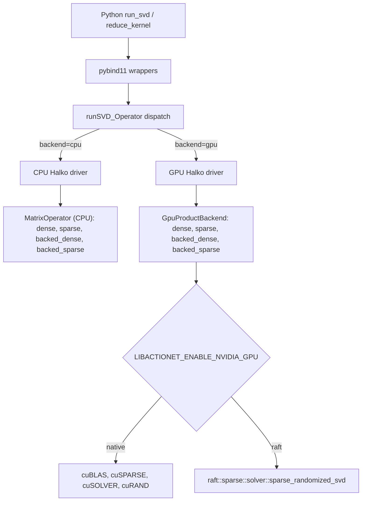

## Audit summary (current state, 2026-07-12)

The two prior plans have been substantially executed already. The public Python SVD surface is now `{auto, halko, irlb}`. PRIMME and Feng are removed from Python and from every auto-selection heuristic; their C++ sources remain compiled behind quarantine guards for one revert window, tracked in `src/libactionet/TODO.md`. The backed `IRLB -> PRIMME` fast path and the `prefer_block_solver_for_irlb()` hint are gone. IRLB has 64-bit sparse `nnz` support via `ARMA_64BIT_WORD` and explicit per-axis `INT_MAX` guards in `svd_irbla.cpp`. Halko's template overload uses `arma::uword` for row/col dimensions; the operator overload still narrows to `int`, matching the current IRLB axis contract. **No GPU code exists on `dev`.** The scrapped `dev-gpu-v2` attempt (cuBLAS-backed PRIMME dispatch) is fully rolled back.

Executed vs unfinished from the prior plans:

- Executed: `plans/svd_strategy_redesign_87cab3b6.plan.md` Phase 1 + Phase 2, plus Feng retirement (an addition beyond that plan). PRIMME/Feng quarantined at C++ level.
- Executed: `plans/SVD_STRATEGY_REDESIGN_v2.md` Objective 1 (PRIMME hidden, 64-bit sparse without PRIMME), and the CPU side of Objective 2 (public surface reduced, auto-selection consistent).
- Not started: Phases 3-5 of the 87cab3b6 plan (GPU prototype, GPU public surface, PRIMME deletion). Objectives 3-6 of SVD_STRATEGY_REDESIGN_v2 (backed GPU path, native/RAFT choice, public API kwargs, benchmarks).

This plan supersedes both prior plans for the GPU work; the CPU cleanup they specified is already done.

## User-selected direction

1. GPU library: prototype native CUDA (cuBLAS + cuSPARSE + cuSOLVER + cuRAND) and RAPIDS RAFT `sparse_randomized_svd` in parallel behind a build flag, and pick a winner via a numerical/wallclock bake-off before public exposure.
2. v1 scope: one plan, staged. In-memory dense/sparse first, then backed dense, then backed sparse, all in the same rollout before the public API flip.

## Architecture

The randomized SVD driver is separated from the matrix-product implementation. Dense, sparse, backed-dense, backed-sparse, CPU, and GPU inputs differ only in product backends, not in the top-level SVD algorithm.

Design boundaries (not renegotiable during implementation):

- The public Python surface remains IRLB (CPU only) and Halko (CPU, and — after this plan — GPU).
- GPU only accelerates Halko in v1. GPU IRLB is out of scope.
- Backed GPU does not wrap CPU `MatrixOperator::matmat`. It reads chunks from HDF5 straight into device buffers via a new `BackedChunkStream`-style interface, exactly per `plans/SVD_STRATEGY_REDESIGN_v2.md` Objective 3.
- The three Python kwargs and their semantics are fixed by `plans/GPU_INTEGRATION.md` and are not re-litigated.

## Files touched

libactionet (C++ core):

- `src/libactionet/cmake/ConfigureCUDA.cmake` (new) — feature-gated `LIBACTIONET_ENABLE_NVIDIA_GPU=OFF` default. CUDA 12.2 floor, Ampere+ compute capabilities.
- `src/libactionet/cmake/ConfigureRAFT.cmake` (new, Track B only) — `find_package(raft)` from the rapidsai channel, gated on both `LIBACTIONET_ENABLE_NVIDIA_GPU` and a second `LIBACTIONET_GPU_BACKEND=raft` sub-option.
- `src/libactionet/include/decomposition/execution_policy.hpp` (new) — `ExecutionPolicy` struct, `ComputeBackend` enum (`CPU`, `GPU`, `AUTO`).
- `src/libactionet/include/decomposition/svd_main.hpp` — extend `runSVD_Operator` and `runSVD` with an `ExecutionPolicy` parameter; keep existing overloads as thin CPU-only shims.
- `src/libactionet/include/decomposition/gpu_product_backend.hpp` (new) — device-resident `SvdProductBackend` interface (`apply` / `apply_transpose` on device blocks). Compiled only when GPU is on.
- `src/libactionet/include/io/backed_h5ad/backed_chunk_stream.hpp` (new) — HDF5-facing chunk-view interface separate from `MatrixOperator`.
- `src/libactionet/src/decomposition/svd_halko_gpu_native.cu` (new, Track A).
- `src/libactionet/src/decomposition/svd_halko_gpu_raft.cpp` (new, Track B).
- `src/libactionet/src/decomposition/gpu_canary.cu` (new) — the mandatory small dummy solve; called by `is_gpu_available()`.
- `src/libactionet/include/errors/gpu_error.hpp` (new) — `GpuError`, `GpuUnavailableError`, `GpuRuntimeError` mapped one-to-one to the Python taxonomy in `plans/GPU_INTEGRATION.md`.
- `src/libactionet/context/DECISIONS.md` — record "GPU backend: parallel prototype, native vs RAFT" and the CUDA/compute-capability floor.
- `src/libactionet/context/GPU_BACKEND_PLAN.md` (new, replaces the missing file referenced by `TODO.md` and `plans/GPU_INTEGRATION.md`) — C++/build-side authoritative doc.

actionet-python (bindings + Python):

- `src/actionet/bindings/wp_decomposition.cpp` and `wp_io.cpp` — accept the three kwargs, translate to `ExecutionPolicy`, catch and re-raise the C++ GPU error taxonomy.
- `src/actionet/bindings/_core.cpp` — export `BACKEND_CPU`/`BACKEND_GPU`/`BACKEND_AUTO` integer constants and the `GpuError` classes.
- `src/actionet/decomposition/svd.py` — thread `compute_backend` / `device_id` / `allow_cpu_fallback` through `run_svd`; record resolved policy on the returned dict when `return_operator_compatible=False`.
- `src/actionet/decomposition/kernel.py` — same for `reduce_kernel`; write resolved policy to `adata.uns[f"{key_added}_params"]`.
- `src/actionet/__init__.py` — re-export `GpuError`, `GpuUnavailableError`, `GpuRuntimeError`.
- `tests/test_gpu_svd_parity.py` (new) — numerical parity vs CPU Halko across dense/sparse/backed-dense/backed-sparse, gated by `@requires_gpu`.
- `tests/test_gpu_backend_policy.py` (new) — kwarg validation, fallback semantics (probe fail and runtime fail), metadata symmetry. All GPU-touching cases gated by `@requires_gpu`.
- `tests/benchmark_gpu_svd.py` (new) — wall-time, peak GPU memory, HDF5 pass count, host-to-device transfer volume across in-memory + backed tiers.
- `.github/workflows/gpu-smoke.yml` (new or extended) — macOS no-GPU, Linux CPU-only, Linux GPU smoke-build against CUDA 12.2 stubs.

## Non-goals

- Deleting the quarantined PRIMME/Feng sources. That is a separate cleanup ticket (already tracked in `src/libactionet/TODO.md`) and is gated on this plan reaching stabilization.
- GPU IRLB. Out of scope; not requested.
- GPU ACTION, GPU network, GPU annotation. Out of scope; downstream of a stable GPU SVD.
- Widening Halko's operator overload to `arma::uword` axes. Follow-up cleanup; the current `INT_MAX` per-axis limit is well past realistic backed-atlas sizes and matches IRLB's contract.

## Acceptance gates

Per `plans/SVD_STRATEGY_REDESIGN_v2.md` Objective 6:

- Correctness is mandatory before exposing GPU in the public API. Singular value correlation `sigma_corr >= 0.999998` vs CPU Halko on every parity test, matching the existing CPU benchmark bar.
- Backed GPU speedup is the primary performance gate; in-memory GPU speedup is secondary.
- CPU-only builds unchanged by default (`LIBACTIONET_ENABLE_NVIDIA_GPU=OFF`).
- macOS CI must remain green as the regression guard (the CMake option is silently ignored on macOS).
- Linux GPU smoke-build must link against CUDA 12.2 stub libraries.
- Manual WSL2 + RTX 4000 Ada validation is required before each merge that touches GPU code.

## Open questions to resolve during Stage 1

- CPU sparse in-memory default: stay on IRLB, or move to Halko for shared-driver consistency once the CPU Halko refactor lands? Empirically IRLB wins 3-6x on sparse (`docs/svd_algorithm_benchmark.md`), so the default stays IRLB unless the shared driver closes that gap by more than 10%.
- Whether the CPU backed sparse operator's `fastlog` transform is reproduced device-side in v1 or kept on the host. Recommended: host-side transforms in v1 for semantic parity; move to device kernels only if profiling shows host transforms are a bottleneck.
- Whether cuSPARSE's 64-bit sparse index support is enabled from day 1 or after correctness lands.

## Deferred to a follow-up plan

- Deleting `svd_primme.*`, the vendored PRIMME tree, `ConfigurePRIMME.cmake`, and the R-build filter (per `src/libactionet/TODO.md` "Delete quarantined PRIMME").
- Deleting `svd_feng.*` and the R wrapper's `algorithm=2` binding (per `context/DECISIONS.md`).
- GPU support for `reduce_kernel`'s non-SVD steps (currently the kwarg is threaded through but only the SVD sub-call is GPU-eligible).
